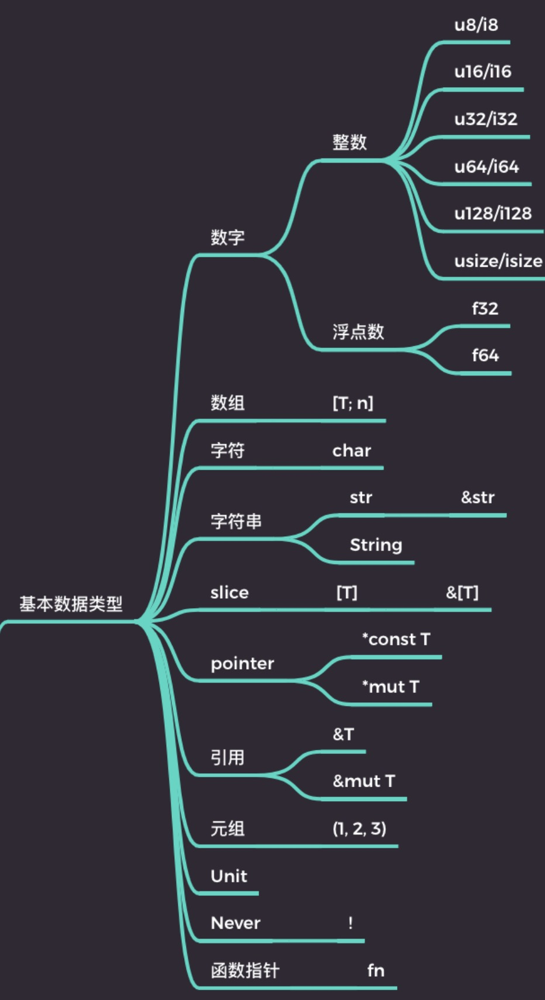
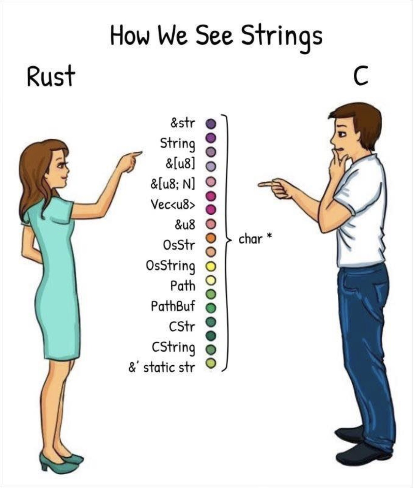
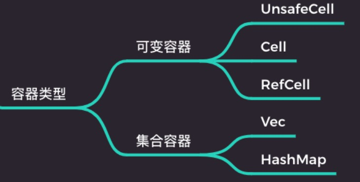

Rust目标：保证内存安全、保证一致性、表达明确的语义、零成本抽象表达能力。Rust类型系统使用两个相辅相成的概念，第一，类型，`Rust` 中一切皆类型，针对不同的场景精致地切分了不同的类型，方便编译期对其进行静态分析。第二，行为。`Rust`通过`trait`来规范这些类型的行为，力求做到类型安全。
# 数据类型(上)-Rust中类型
## 类型
1. 基本数据类型
2. 自定义复合类型
3. 容器类型 4. 泛型
5. 特定类型
### 基本数据类型
`Rust`包含的基本数据类型如下图

#### 字符串
`Rust`字符是一个`UNIQUE`的标量类型，就是指实际存在的`UNIQUE`的字符，它占四个字节。`Rust`字符串类型如下图

`Rust`根据字符串使用场合进行分类：
1. 字面量
2. 动态可增长字符串
3. 从一段字符串中截取的片段（切片）
4. 字符串编码
5. FFi 中需要转换字符串到 C 或 OS 本地字符串
6. 遵循特定格式的文件路径

为了保证类型系统能够覆盖到这些全部的场景，并且能够保证类型安全，`Rust`设计了这么多字符串类型。
#### 字符串与切片
`Rust`中字符串是`UTF-8`编码的`u8`序列
1. str -> &str
2. [T] -> &[T], 比如 &[u8]
3. String -> Vec<u8>

`str`类型代表字符串切片类型，·`Rust`内存分配默认是在栈上进行分配并且通过栈来管理堆内存，所以在编译期就要确定类型的大小，但是编译器不可能知道开发者使用多长的字符串，所以这里`str`类型是一个动态大小的类型。字符串切片类型最常用的类型就是`str`引用类型，即：`&str`，这类引用表示的是一个胖指针，表示在栈上存储一个指向静态区域或者堆内存的指针以及数据的长度，因为它比普通指针多占用了空间，所以叫胖指针。

对于字面量来说，字符串可以存储在静态数据区，栈内存只存指针，所以它是一个静态引用字符串切片类型。切片类型代表的是一个有连续内存空间的序列，用`[T]`表示，它也是一个动态大小类型。切片类型也是以胖指针形式出现。

`u8`序列切片和字符串切片的区别在于，字符串切片虽然也是字节序列但是它还表示一串`UTF-8`编码的合法字符串，字符串切片可以安全的转化为`u8`序列，但是反过来不一定成立，`u8`序列不一定是合法的`UTF-8`编码字节序列

动态可增长`str`类型必须放在堆上，所以它实际上是具有合法的`UTF-8`编码的`u8`动态数组序列，同时`u8`动态数组序列不一定中合法的`UTF-8`编码。
#### 指针类型
1. 原始指针， *mut T 和 * const T。一般用于`Unsafe Rust`中。
2. NonNull 指针。 它是 Rust 语言建议的 *mut T 指针的替代指针。 NonNull 指针是非空指针，并且是遵循生命周期类型协变规则。
3. 函数指针: 函数指针是指向代码的指针，而非数据。 你可以使用它直接调用函数。
#### 引用
1. &T 和 &mut T
2. 引用与指针的主要区别:
   * 引用不可能为空
   * 拥有生命周期
   * 受借用检查器保护不会发生悬垂指针等问题
#### 元组
唯一的异构序列，如在元素中放入不同类型的值
1. 不同长度的元组是不同类型。
2. 单元类型的唯一实例等价于空元组。
3. 当元组只有一个元素的时候，要在元素末尾加逗号分隔 这是为了方便和括号操作符区分开来，如：`(3,)`。
#### Never 类型
代表的是不可能返回值的计算类型
1. 类型理论中，叫做底类型， 底类型不包含任何值， 但它可以合一到任何其他类型。
2. Never 类型使用`!`表示。
3. 目前还未稳定，但是在 Rust 内部已经在用了。
### 自定义复合类型
1. 结构体 Struct
2. 枚举体 Enum
3. 联合体 Union
#### 结构体 Struct
1. 具名结构体
2. 元组结构体
3. 单元结构体
```
// 具名结构体
struct Point {
  x: f32,
  y: f32,
}

// 元组结构体
struct Pair(i32, f32);

// 单元结构体
struct Unit;

fn main() {
  let point = Point{ x: 1.0, y: 2.0 };
  let pair = Pair(1, 2.0);
  let unit1 = Unit;
  let unit2 = Unit;
}
```
单元结构体没有字段，可被看作一个占位类型，单元结构体的实例就是它自身，无论创建多少个实例，编译器都会把它们优化为同一个。单元结构体不会占用实际内存空间，是一个零大小的类型。

元组结构体一般常用于包装一些基本数据类型去扩展它的功能。如下面代码，通过结构体`Score`对`u32`进行包装来表示一个分数的概念，可以自己定义关于分数的一些方法，与数字类型`u32`进行区分。

**元组结构体只包含一个参数，这种形式叫NewType模式**
```
struct Score(u32);

impl Score {
  fn pass(&self) -> bool {
    self.0 >= 60
  }
}

fn main() {
  let s = Score(59);
  assert_eq!(s.pass(), false);
}
```
#### 结构体内存布局
编译器会对结构体进行内存对齐，以便提升CPU的访问效率，结构体对齐规则一般为其成员的最大对齐元素为对齐大小，并且每个成员都得进行对齐
```
struct A {
  a: u8,
  b: u32,
  c: u16,
}

fn main() {
  println!("{:?}", std::mem::size_of::<A>()); // 8;
}
```
理论上按`a, b, c`的顺序来排，最大的数据是`u32`结构，它点32位，也就是4个字节，u8是一个字节，u16是两个字节，理论上会按照u32（4个字节）对齐，u8会补齐3个字节，u16会补齐2个字节，补齐后的结构体A的大小应该是12个字节，但是通过 `std::mem::size_of::<A>()`来打印，发现结构体`A`的大小是8个字节，产生这样结果的原因是因为`Rust`编译器进行字段重排，优化内存占用。字段重排后的结构体`A`内字段顺序如下：
```
struct A {
  b: u32,
  c: u16,
  a: u8,
}

fn main() {
  println!("{:?}", std::mem::size_of::<A>()); // 8;
}
```
重排后，字段`a`补齐1个字段，结构体`A`的大小是8个字节，是结构体`A`最大字段`u32`4个字节的倍数，满足了CPU的优化要求。
#### 枚举体与联合体内存布局
枚举体内存布局与联合体是相似的，是以枚举类型成员最大的对齐值为准，不需要为每个枚举值都对齐。
```
enum A {
  One,
  Two,
}

enum E {
  N,
  H(u32),
  M(Box<u32>),
}

union U {
  u: u32,
  v: u64,
}

fn main() {
  println!("A: {:?}", std::mem::size_of::<A>());
  println!("Box<u32>: {:?}", std::mem::size_of::<Box<u32>>());
  println!("E: {:?}", std::mem::size_of::<E>());
  println!("U: {:?}", std::mem::size_of::<U>());
}
```
枚举体实际上就是带`tag`的联合体，`tag`可以理解为是一种编号，它就像元组索引一样，枚举体`A`中的每个值实际上不占大小，但是`tag`占1个字节，所以枚举体`A`共占1个字节。枚举体`E`中最大的对齐值是`M(Box<u32>)`，`M`的`tag`占1个字节，`Box<u32>`占8个字节，`tag`需要补齐7个字节，所以枚举体`E`的长度是16个字节。联合体`U`没有`tag`，所以联合体只需要看内部的字段类型，它的最大对齐字段是`u64`占8个字节，所以联合体`U`占8个字节。
### 容器类型

可变容器支持内部可变性，可以允许在必要的情况下在不可变的基础上实施可变。
#### 内部可变性
1. 与继承式可变相对应。`Rust`默认是不可变的，继承式可变是`Rust`默认的强制声明。
2. 由可变性核心原语 UnsafeCell <T> 提供支持。其本质是把容器内的`T`原始可变指针`*mut T`给你，`UnsafeCell`是`Rust`中唯一合法的可以把不可变引用转变为可变指针的方法
3. 基于 UnsafeCell <T> 提供了 Cell<T> 和 RefCell<T>两个内部可变容器。
```
use std::cell::Cell;
struct Foo {
  x: u32,
  y: Cell<u32>,
}

fn main() {
  let foo = Foo { x: 1, y: Cell::new(3) };
  assert_eq!(1, foo.x);
  assert_eq!(3, foo.y.get()); // Cell 的 get 方法获取容器内的值
  foo.y.set(5); // set 方法修改容器内的值
  assert_eq!(5, foo.y.get());

  let s = "hello".to_string();
  let bar = Cell::new(s);
  let x = bar.into_inner();
  bar; // error: use of moved value: `bar`
}
```
结构体 `Foo` 中的字段 `y`本身是不可变的，只能通过容器`Cell`来获得内部可变性。可以通过 `Cell`的`get`方法获取容器内的值，通过`set`方法修改容器内的值，`Cell`的`get`方法只能用于实现了`Copy`的类型，如果没有实现`Copy`则无法使用`get`和`set`方法。变量`s`是一个动态字符串`String`类型，将其放入`Cell`容器内后，通过`into_inner`方法将容器内的值转移出来，容器中的值被转移出来后，之前的容器实例化`bar`将无法再使用。

`Cell`容器是通过移入移出值达到内部可变的目的。如果需要使用引用，则需要使用`RefCell`容器类型
```
use std::cell::RefCell;
fn main() {
  let x = RefCell::new(vec![1, 2, 3, 4]);
  println!("{:?}", x.borrow());
  let mut mut_v = x.borrow_mut();
  mut_v.push(5);
  println!("{:?}", x.borrow());

  let mut mut_v2 = x.borrow_mut(); // thread 'main' panicked at 'already borrowed: BorrowMutError' 违反了可变借用独占的原则。
}
```
`RefCell`容器中放入了动态可增长数组，通过`borrow`和`borrow_mut`方法来操作内部的值，这两个方法分别对应`Rust`中`不可变引用`和`可变引用`的概念。`RefCell`适合没有实现`Copy`的类型，它有运行时开销，维护运行时借用检查器，如果运行时违反了借用检查就会报错。这个不是编译时检查，而是运行时检查。
### 泛型
泛型就是参数化类型，函数的参数类型被写成`T`，这个`T`就叫做泛型，本质是把具体的类型给参数化，这个`T`其实是一种形参，只有在实际调用时才会传入具体的类型。

泛型也是一种抽象方式，但是在`Rust`中它是零成本，因为泛型会在编译期就单态化，即：实际调用的位置生成具体类型相关的代码，也叫静态分发。

如下面的函数在实际调用的位置会静态分发为两个不同类型参数的函数
```
fn foo<T>(x: T) -> T {
  return x;
}

fn main() {
  assert_eq!(foo(1), 1);
  assert_eq!(foo("hello"), "hello");
}
```
在实际调用时会静态分发为下面两个函数
```
fn main {
  fn foo(x: i32) -> i32 {
    return x;
  }

  fn foo(x: &'static str) -> &'static str {
    return x;
  }

  foo(1);
  foo("hello");
}
```
当`Rust`不能自动推断出数据类型时，需要手工指定类型，这时会使用`turbofish操作符`
```
foo(1); 等价于 foo::<i32>(1);
foo("hello") 等价于 foo::<&'static str>("hello");
```
### 特定类型
所谓特定类型，是指专门有特殊用途的类型
1. PhantomData <T>， 幻影类型。 一般用于 Unsafe Rust 的安全抽象。
2. Pin<T> 固定类型，为了支持异步开发而特意引进，防止被引用的值发生移动的类型。
