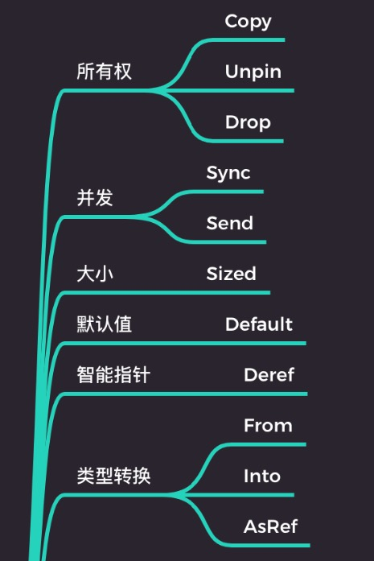

# 数据类型(下)-Rust中类型的行为
## 类型的行为
`Rust`语言一切皆为类型，类型系统如何保证类型安全交互
```
fn main() {
  let four: u32 = "4".parse().unwrap();
  assert_eq!(4, four);
}
```
```
struct Point(i32, i32);

fn main() {
  let p = "(1, 2)".parse::<Point>();
  assert_eq!(p.unwrap(), Point(1, 2));
}
```
上面两段代码中编译器如何知道`"4"`可以安全的转换为`4`？`"(1, 2)"`如何安全的转换为`Point`呢？，查看Rust中的`parse`方法源码可以看到`parse`方法实现方式如下：
```
  pub fn parse<F: FromStr>(&self) -> Result<F, F::Err> {
    FromStr::from_str(self)
  }
```
通过查看`parse`方法的内部实现，可以看到如果对`u32`类型和`Point`类型实现`parse`方法，需要为`u32`和`Point`类型分别实现一个`from_str`方法。这样，在`u32`类型或者`Point`类型在调用`parse`方法时才能实现预期的类型转换。具体实现方法如下：
```
impl u32 {
  fn from_str(s: &str) -> u32 {
    // do something
  }
}
```
```
impl Point {
  fn from_str(p: &str) -> Point {
    // do something
  }
}
```
对`u32`和`Point`类型实现了`from_str`方法后，使用`parse`方法时效果如下
```
"4".parse::<u32>(); // 等价于 u32::from_str("4");
"(1, 2)".parse::<Point>() // 等价于 Point::from_str("(1, 2)");
```
`u32`和`Point`类型使用`parse`方法，都会调用`from_str`方法，向上抽象一层，这两种类型都遵循相同的行为。如果编译器能识别这种行为，并且开发者可以在函数签名就可以显式地指定它，那它就可以极大地增强开发体验。为了解决这个问题，`Rust`引入了`trait`

## trait
`Rust`引入`trait`来统一行为接口。 在面向对象中，`trait`它代表一种方法，用于扩展类的功能。支持trait的语言包括：
* haskell -> 类型类(TypeClass)
* Ruby -> 混入(Mixin)
* Java/Kotlin -> 接口(Interface)
* Swift/Elixir -> 协议(Protocol)
* Scala/Rust -> 特质(trait)

使用`trait`行为抽象改造上面的事例
```
// 定义 FromStr trait
pub trait FromStr {
  type Err;
  // 定义 trait 的关联方法，这个关联方法只有方法签名没有实现
  fn from_str(s: &str) -> Result<Self, Self::Err>;
}

// 为 u32 实现 FromStr
impl FromStr for u32 {
  fn from_str(s: &str) -> Result<Self, Self::Err> {
    // do something
  }
}

// 为 Point 实现 FromStr
impl FromStr for Point {
  fn from_str(s: &str) -> Result<Self, Self::Err> {
    // do something
  }
}

impl str {
  // 使用 FromStr 对泛型 F 进行限定
  pub fn parse<F: FromStr>(&self) -> Result<F, <F as FromStr>::Err> {
    F::from_str(self);
  }
}
```
定义了`FromStr trait`，并在这个`trait`中定义了关联方法`from_str`，这个关联方法只有方法签名没有实现。之后为`u32`和`Point`类型实现`FromStr trait`，然后在 `parse` 方法的方法签名上使用`F::FromStr`这种形式来表示，`parse`只接受实现了`FromStr trait`的类型，也就是说`F::FromStr`这种形式表示拥有`from_str`行为的类型才能被安全地转换。`trait`代表了一种接口，是对类型行为的抽象。
### trait 是一种特设多态
像`trait`这样定义一个接口，可以有多种实现，也叫`Ad-hoc`多态（特设多态），这种多态与动态语言中鸭子类型相似。如：数字加法与字符串加法是不同的行为。

`Rust`中数字加法与字符串加法
```
fn main() {
  let num = 1 + 1;
  let s = "1".to_string() + "1";
  assert_eq!(num, 2);
  assert_eq!(s, "11");
}
```
`Rust`中标准库中定义的`Add trait`代码如下
```
pub trait Add<Rhs = Self> {
  type Output; // 关联类型 Output

  fn add(self, rhs: Rhs) -> Self::Output;
}
// Self 代表实现了该 trait 的类型
```
`u32`的加法实现
```
impl Add for u32 {
  type Output = u32;

  fn add(self, other: u32) -> u32 {
    self + other
  }
}
```
动态字符串String的加法实现
```
impl Add<&str> for String {
  type Output = String;

  fn add(mut self, other: &str) -> String {
    self.push_str(other);
    self
  }
}
```
#### trait 一致性规则/孤儿规则
`trait`或`类型`有一个是在本地定义的，才允许修改，否则不允许修改。如下面的代码中`Add trait`和`u32类型`都是标准库中定义的，不是在本地定义的，所以`Rust`不允许自行修改`Add trait`的行为。
```
impl Add for u32 {
  type Output = u32;

  fn add(self, other: u32) -> u32 {
    self + other + 42
  }
}
```
在孤儿规则允许情况下可进行函数重载。
```
struct A;
impl A {
	fn hello(&self) {
		println!(" in A");
	}
}

trait Hello {
	fn hello(&self);
}
impl Hello for A {
	fn hello(&self) {
		println!("from Hello trait");
	}
}

fn main() {
	let a = A;
	a.hello(); // in A
  // 完全无歧义限定语法（Fully Qualified Syntax for Disambiguation)
	<A as Hello>::hello(&a); // from Hello trait
}
```
#### trait 对类型的行为逻辑进行操控
位置表达式置于值上下文时，变量绑定默认会发生转移的行为，叫做`move`语义。如下面的代码，变量绑定`a`是一个动态字符串，将`a`重新绑定给`b`就会发生转移，转移意味着本来是`a`绑定了字符串的内存和数据拥有这片内存的管理权，但是现在管理权转换给了`b`，变量绑定`a`就无法再被使用。也就是所有权被转移。
```
fn main() {
  let a = "Hello".to_string();
  let b = a;
  // a; // 变量绑定 a 已被 move，无法使用
}
```
在`Rust`中并不是所有类型都会发生`move`。如下面的代码变量绑定`a`是个数字类型，它被重新绑定给`b`但是所有权并没有发生转移，`a`仍然可用。对于这类简单的数据类型默认实现了`Copy trait`，被`Copy trait`标识的数据类型可以安全在的栈内存上进行赋值。所以在重新绑定给`b`的时候，变量`a`是将自身的副本绑定给了`b`，所有权没有发生转移。所有权转移虽然是默认行为，但是由于`Copy trait`的存在，这种行为的逻辑就被更改了。
```
fn main() {
  let a = 42;
  let b = a;
  a; //变量绑定 a 没有被 move，可以继续使用
}
```
#### 仿射类型(Affine Type)
`Rust`语言类型系统遵循一种叫做仿射类型的逻辑进行推理。仿射类型是类型系统中用于标识内存等资源，最多只能被使用一次，而`Copy trait`则在这个类型系统的逻辑推理中起到了一个重要的作用。这就是`Rust`语言内存安全和逻辑安全的秘密武器。

`Rust`内置`trait`


* 与所有权相关的`trait`除了`Copy`外还有`Drop`和`Unpin`等，`Drop`定义了资源如何被析构，`Unpin`代表了使用`pin`固定之后还能安全移动的类型。
* 与线程安全相关的有`Sync`和`Send`两个`trait`。`Sync trait`代表了类型在线程间安全共享，`Send trait`代表了类型可以在线程间安全地转移。在它们的共同作用下`Rust`在编译期就可以排除线程不安全的一些问题。
* `Size trait` 这个 `trait`在编译期确定大小的类型。
* `Default trait`它标识了实现默认值的类型。
* `Deref trait`它是智能指针的一个标志，实现了`Deref trait`的类型都可以看作是一个智能指针，因为该`trait`代表了一种解引用的行为，并且`Rust`在某些场合还支持自动解引用来支持提升开发体验。
* 类型转换`From trait`, `Into trait`, `AsRef trait` 则表示了类型之间的转换行为。
